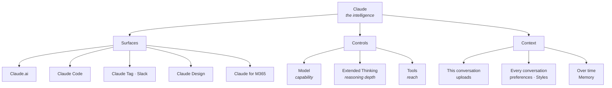
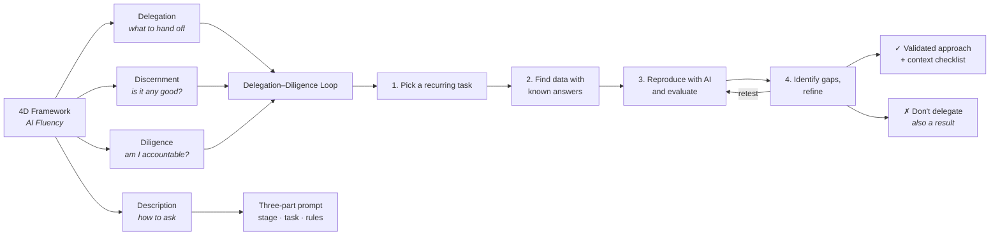
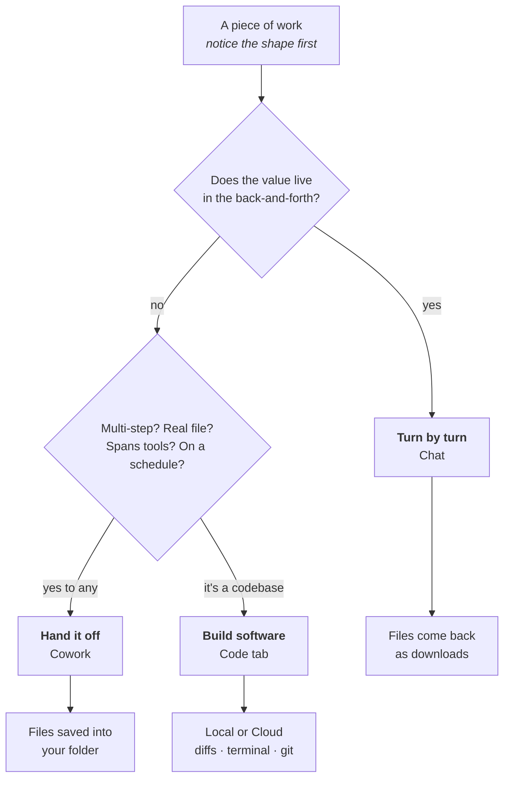

> [!info] Frozen copy
> Derived study material built by Claude on 2026-09-14 from Lessons 1.1 to 2.1. Kept exactly as it was and not updated. The links inside it point to the old project layout. The course notes are in [[Claude-101]].

# Claude 101 — Study Guide

**Derived from:** [`notes.md`](notes.md) · **Covers:** Lessons 1.1–2.1 of 14 · **Last built:** 2026-09-14

This is derived study material, rebuilt as lessons are captured. Four sections, use whichever fits the moment:

1. [Cheat Sheet](#1-cheat-sheet) — the testable core, compressed
2. [Practice Questions](#2-practice-questions) — 38 questions with answer key
3. [Flashcards](#3-flashcards) — 117 cards across two decks (general + a dedicated 4D Framework deck)
4. [Concept Map](#4-concept-map) — how the pieces relate

---

## 1. Cheat Sheet

### Design principles
**Helpful, harmless, honest** — via **Constitutional AI**: aligned against an explicit written set of principles rather than purely on human preference labels. Practical effects: avoids toxic/discriminatory output, declines illegal or unethical assistance, operates transparently.

### Capability areas

| Area | Key fact |
|---|---|
| Writing & content | Takes direction on tone and personality; iterate to match your voice |
| Research & analysis | **200K+ tokens** context (~500 pages); **up to 1M** on Pro/Max/Team/Enterprise with supported models |
| Coding | Write, debug, explain across languages |
| Problem-solving | **Thinking** = optional step-by-step reasoning before answering |
| Learning | **Learning mode** guides your reasoning instead of giving answers |

### Access surfaces

| Surface | One-line definition |
|---|---|
| **Claude.ai** | Web/desktop/mobile. Conversation, writing, research, file creation |
| **Claude Code** | Agentic coding — edits files, runs commands, creates commits |
| **Claude Tag** | Claude in Slack; searches channels, DMs, shared files |
| **Claude Design** | Description/sketch/screenshot → interactive prototype |
| **Claude for Microsoft 365** | Sidebar in Excel, PowerPoint, Word, Outlook |

**Plans:** Free, Pro, Max, Team, Enterprise. Conversations, projects, memory, preferences sync across devices.

### The three shapes of desktop work

You don't pick a tab — you notice the shape of the work and the tab follows.

| Shape | Value is in… | Tab |
|---|---|---|
| **Turn by turn** | The exchange. You steer every turn | **Chat** |
| **Handing work off** | The finished deliverable. Claude plans and executes | **Cowork** |
| **Building software** | Working directly in a codebase | **Code tab** |

**The categorical difference:** Chat reads uploads and returns **downloads**. Cowork reads a **folder** and saves finished work back into it.

**Chat — desktop-native extras:** double-tap **Option** for quick entry (Mac) · screenshots & window sharing (Mac) · dictation (Mac) · desktop connectors

**Cowork capabilities:** local folder access · scheduled tasks (catch up if app was closed) · subagents (parallel, own context) · Projects · browser use (Claude in Chrome) · computer use (research preview, Pro/Max) · plugins (Customize → Plugins)

**Cowork control points:** scope/format questions up front → plan shown before starting → watch progress and steer → approval gates on consequential actions (sending email, sharing a file)

**Code tab — environments:** **Local** (folder, local tools, previewable dev server) · **Cloud** (GitHub repo; sessions continue when the app is closed)

**Code tab — autonomy modes:** Manually approve · Accept edits · Plan

**Availability:** Cowork and Code tab are Pro, Max, Team, Enterprise.

### The three-part prompt

| Part | Question |
|---|---|
| **Set the stage** | Role, objectives, context |
| **Define the task** | What action — write, analyze, build, research? |
| **Specify rules** | Style, tone, format, examples |

Rooted in **Description** (see 4D below).

### The three dials

| Dial | Controls | Turn it up when |
|---|---|---|
| **Model** (Opus / Sonnet) | Raw capability | Task is genuinely hard |
| **Extended Thinking** | Reasoning depth per turn | Needs careful step-by-step work |
| **Tools** (web search, connectors) | What Claude can *reach* | Claude lacks information, not intelligence |

**Default posture:** Sonnet · thinking off · tools on as needed. Escalate deliberately.
**Gotcha:** switching models starts a new chat.

### Uploads
**PDF, DOCX, CSV, TXT, PNG, JPEG** + common image formats. Claude parses text *and* visual elements (charts, graphics) inside documents.

### Troubleshooting — symptom → fix

| Symptom | Cause | Fix |
|---|---|---|
| Too generic | Not enough context | Add audience, role, constraints |
| Too long / short | Claude guessing at length | State it explicitly |
| Wrong format | Understood *what*, not *how* | Show an example; describe structure |
| **Confident but wrong** | Plausible generation — worst on specific facts & niche topics | Verify independently; ask for sources/confidence; **enable web search** |
| Tone off | Defaults to helpful & professional | Describe tone plainly; give an example |

### Iteration moves

| Move | Use when |
|---|---|
| Follow-up question | Close, needs depth or a different angle |
| Feedback | Content right, delivery wrong |
| Redirect | Went the wrong direction |
| Restart (new chat) | Context polluted beyond recovery |
| **Edit & resubmit** (pencil icon) | Refining the request rather than appending to it |

**Mindset:** first prompt is the opening of a conversation, not a one-shot. First drafts are starting points. Specific feedback beats vague.

### Persistence layers

| Scope | Mechanism |
|---|---|
| One conversation | Uploads, follow-up turns |
| Every conversation | Settings preferences, Styles |
| Learned over time | Memory |

**Memory** — auto-saves role, preferences, decisions, working style. Reviewable/editable/deletable in Settings. Syncs across devices.
**Styles** — presets (concise, formal, explanatory) or custom. Applies across all conversations.
**Preferences path:** Settings → General → "What personal preferences should Claude consider?"

### Research
Decomposes a complex question automatically, explores hundreds of sources, returns a **cited report** in **5–45 minutes**.

### Projects

A **self-contained workspace** with four components of its own: **memory · chat histories · knowledge base · custom instructions**.

**Create one when** you have reference materials used repeatedly · consistent requirements for how Claude responds · team collaboration needs. Ongoing work, not one-off questions.

**Setup:** Sidebar → Projects (claude.ai/projects) → **+ New Project** → name, description, visibility.

⚠️ **Claude does not see the project description.** It's for you and teammates. Anything Claude must act on goes in **instructions**.

**Good instructions cover:** context about the work · process · tone and style · specific requirements. They apply to every chat in the project and **work alongside** user preferences and styles. Can also automate workflows — "when I upload X, produce Y using this template."

**Knowledge base formats:** PDF, DOCX, CSV, TXT, HTML, and more. Google Drive can be connected.

**RAG scaling:**

| State | Behavior |
|---|---|
| Below the limit | Whole knowledge base loaded into context |
| Approaching the context limit | Claude **searches** the files and retrieves only what's relevant |
| Capacity gain | **Up to 10x**, quality maintained |
| Signal | Visual indicator when the project is RAG-enabled |

**Because retrieval is search:** descriptive filenames are retrieval signal, and **proximity** of related files encodes relationships. Reference documents by name in prompts to focus the search.

**Permission levels (Team/Enterprise):**

| Level | Can do |
|---|---|
| **Can view** | See contents, access knowledge, chat. No changes |
| **Can edit** | Modify instructions, update knowledge, manage members |
| **Owner** | Everything, including who sees it — specific people or the whole org |

**Sharing:** open project → **Share project** → add by name/email, paste a list for bulk, or share with "Everyone at [org]" to make it discoverable in the **Team** tab. Recipients find it under **"Shared with me."**

**Best practices:** start focused then expand · keep knowledge current · write specific instructions · name files descriptively and group related ones · reference documents by name when asking.

### AI Fluency — the 4D framework

**AI Fluency** = the ability to collaborate effectively with AI tools. Not knowing which buttons to click — developing the *judgment* to use AI well across different situations.

**Attribution:** developed through research collaboration between **Prof. Rick Dakan** (Ringling College of Art and Design) and **Prof. Joseph Feller** (University College Cork).

**Four core competencies that work together.** Each breaks into sub-components — those are what actually get tested.

#### D1 — Delegation
*Deciding on what work should be done by humans, what work should be done by AI, and how to distribute tasks between them.*

| Sub-component | Meaning |
|---|---|
| Understanding your goals | What outcome are you actually after? |
| Understanding AI capabilities | What is this tool genuinely good and bad at? |
| Making strategic choices about collaboration | How the work gets split, not just whether AI is involved |

#### D2 — Description
*Effectively communicating with AI systems.*

| Sub-component | Meaning |
|---|---|
| Clearly defining outputs | What you want produced |
| Guiding AI processes | How you want it to get there |
| Specifying desired behaviors and interactions | How it should act and respond along the way |

#### D3 — Discernment
*Thoughtfully and critically evaluating AI outputs, processes, behaviors, and interactions.*

| Sub-component | Meaning |
|---|---|
| Assessing quality | Is this good work? |
| Assessing accuracy | Is it correct? |
| Assessing appropriateness | Is it right for this audience and situation? |
| Determining areas for improvement | Where does it need to get better? |

Note the four objects of evaluation: **outputs, processes, behaviors, interactions** — not just the final answer.

#### D4 — Diligence
*Using AI responsibly and ethically.*

| Sub-component | Meaning |
|---|---|
| Thoughtful choices about AI systems and interactions | Which tool, used how, for what |
| Maintaining transparency | Disclosing AI's role |
| Taking accountability for AI-assisted work | You own the output regardless of what produced it |

#### Where Claude 101 touches each

| Competency | Where it appears |
|---|---|
| Delegation | §1.3 video — the Delegation–Diligence Loop |
| Description | §1.2 three-part prompt framework |
| Discernment | §1.3 troubleshooting table + evals |
| Diligence | §1.3 — verify, disclose, take accountability |

#### Telling the adjacent pairs apart

The exam-relevant difficulty is discriminating between neighbors, not reciting definitions.

| Confusion | The distinction |
|---|---|
| **Delegation vs Description** | Delegation decides *whether and what*. Description handles *how to ask*. Delegation comes first and can conclude "not this task at all" |
| **Description vs Discernment** | Description is what you send. Discernment is what you do with what comes back |
| **Discernment vs Diligence** | Discernment judges the **work** — is it any good? Diligence governs **your conduct** — are you being responsible, transparent, accountable? |

> **Note —** A useful ordering: Delegation is *before*, Description is *during*, Discernment is *after*, and Diligence runs *throughout*. That's my framing, not the source's, but it makes the four stop blurring together.

> **Note —** The AI Fluency course's own tagline is "collaborate with AI systems effectively, efficiently, ethically, and safely" — four adverbs, not the same four as the D's. Don't conflate the two lists.

### Evals — the lightweight approach

| Step | Do this |
|---|---|
| 1. Gather examples | 5–10 of a task you do regularly, already completed |
| 2. Create test prompts | Include the context you'd naturally have |
| 3. Compare | Key info captured? Tone/style right? What's missing? |
| 4. Refine | Adjust prompts, add examples, or mark where human review is required |

### The Delegation–Diligence Loop
*(from the embedded video, sourced from AI Fluency for nonprofits)*

1. Identify a specific recurring analytical task to delegate
2. Find **past data where you already know the right answer**
3. Work with AI to reproduce it; evaluate output, approach, and communication
4. Identify gaps → refine → test again

**Two valid outcomes:** a validated approach you can trust on new data, *or* the finding that this task shouldn't be delegated. The second is a result, not a failure.

**The line to remember:** *validation builds confidence but does not eliminate responsibility.*

---

## 2. Practice Questions

<details>
<summary><strong>Q1.</strong> What is the name of the training approach behind Claude's helpful/harmless/honest behavior, and what distinguishes it?</summary>

**Constitutional AI.** Claude is aligned against an explicit written set of principles rather than relying solely on human preference labeling. The stated practical outcomes are avoiding toxic or discriminatory output, declining to assist illegal or unethical activity, and operating transparently.
</details>

<details>
<summary><strong>Q2.</strong> Name the three parts of an effective prompt and what each contributes.</summary>

1. **Set the stage** — your role, objectives, and relevant context
2. **Define the task** — the specific action (write, analyze, build, research)
3. **Specify rules** — style, tone, format, and any examples

Together they give Claude the *why*, the *what*, and the *how*. The framework is rooted in **Description**.
</details>

<details>
<summary><strong>Q3.</strong> Define all four competencies in the 4D Framework.</summary>

- **Delegation** — deciding what work humans do, what AI does, and how to distribute between them. Requires understanding your goals and AI's capabilities
- **Description** — communicating effectively with AI: defining outputs, guiding processes, specifying desired behaviors
- **Discernment** — critically evaluating AI outputs, processes, and behaviors for quality, accuracy, and appropriateness
- **Diligence** — using AI responsibly and ethically: thoughtful choices, transparency, accountability for AI-assisted work
</details>

<details>
<summary><strong>Q4.</strong> Claude gives you a confidently wrong answer about a current market figure. Which of the three dials should you check first, and why?</summary>

**Tools** — specifically whether web search or a relevant connector is enabled.

A wrong *current* fact is a reach problem, not a capability problem. Escalating to Opus or enabling Extended Thinking gives you more capable reasoning over the same missing information. Getting the model access to the data is the fix.
</details>

<details>
<summary><strong>Q5.</strong> What is the recommended default configuration, and what is the escalation path?</summary>

Start with **Sonnet, Extended Thinking off**, tools enabled as the task requires. Sonnet is the recommended everyday default — it balances capability against cost.

If the output isn't good enough: enable Extended Thinking, or switch to **Opus** for the most complex tasks. Note that changing models starts a new chat.
</details>

<details>
<summary><strong>Q6.</strong> Claude's first response is good but too formal. What are your options?</summary>

- **Give feedback** in a follow-up. Best when content is right and only delivery is off
- **Edit and resubmit** the original prompt via the pencil icon, if you'd rather not leave the too-formal turn in context
- **Set a Style** if this is a recurring preference rather than a one-off
</details>

<details>
<summary><strong>Q7.</strong> What is the context window size, and what determines whether you get the larger one?</summary>

**200K+ tokens** baseline — roughly 500 pages. **Up to 1M tokens** on **Pro, Max, Team, and Enterprise**, when using supported models. Both the plan tier *and* the model matter.
</details>

<details>
<summary><strong>Q8.</strong> Distinguish Memory from Styles.</summary>

**Memory** is about *context* — what Claude knows about you (role, preferences, past decisions, working style). Accumulates automatically; reviewable and editable in Settings.

**Styles** are about *communication* — how Claude writes back. Presets or custom; set deliberately, applies across all conversations.

One is input, the other is output.
</details>

<details>
<summary><strong>Q9.</strong> What does Research do, and what's the practical constraint?</summary>

Breaks a complex question into sub-questions automatically, explores hundreds of sources, returns a comprehensive **cited** report.

The constraint is **time: 5–45 minutes** — a fire-and-forget move, not something to wait on.
</details>

<details>
<summary><strong>Q10.</strong> Match each surface to its job: Claude Code, Claude Tag, Claude Design, Claude for Microsoft 365.</summary>

- **Claude Code** — agentic coding; edits files, runs commands, creates commits
- **Claude Tag** — Claude in Slack; searches channels, DMs, shared files
- **Claude Design** — description, sketch, or screenshot → interactive prototype
- **Claude for Microsoft 365** — sidebar inside Excel, PowerPoint, Word, Outlook
</details>

<details>
<summary><strong>Q11a.</strong> A colleague says "I used the 4D framework — I wrote a really detailed prompt." Which competencies have they actually exercised, and which have they skipped?</summary>

They've exercised **Description** only.

Skipped:
- **Delegation** — did they decide this task was appropriate for AI in the first place, given their goals and the tool's capabilities?
- **Discernment** — a detailed prompt says nothing about whether they evaluated what came back
- **Diligence** — no transparency about AI's involvement, no accountability for the result

A good prompt is one quarter of the framework. This is the most common misreading of 4D.
</details>

<details>
<summary><strong>Q11b.</strong> Sort each into the right D: (a) "Is this accurate?" (b) "Should AI do this at all?" (c) "I'll disclose that AI helped" (d) "Here's an example of the format I want."</summary>

- (a) **Discernment** — assessing accuracy is one of its four sub-components
- (b) **Delegation** — the whether-and-what decision, which precedes everything else
- (c) **Diligence** — maintaining transparency
- (d) **Description** — specifying desired outputs and behaviors
</details>

<details>
<summary><strong>Q11c.</strong> Discernment and Diligence both involve being careful. What separates them?</summary>

They have different objects.

**Discernment judges the work** — quality, accuracy, appropriateness, and where it needs improvement. It asks: *is this output any good?*

**Diligence governs your conduct** — thoughtful choices about which systems to use, maintaining transparency about AI's role, taking accountability for AI-assisted work. It asks: *am I using this responsibly?*

You can be highly discerning and still fail Diligence — by passing off well-checked AI output as entirely your own.
</details>

<details>
<summary><strong>Q11d.</strong> Name the sub-components of each competency.</summary>

- **Delegation** — understanding your goals; understanding AI capabilities; making strategic choices about collaboration
- **Description** — clearly defining outputs; guiding AI processes; specifying desired behaviors and interactions
- **Discernment** — assessing quality; assessing accuracy; assessing appropriateness; determining areas for improvement
- **Diligence** — thoughtful choices about AI systems and interactions; maintaining transparency; taking accountability for AI-assisted work

Discernment is the only one with four.
</details>

<details>
<summary><strong>Q11.</strong> Your output is too generic and the format is wrong. Are these the same problem? What's the fix for each?</summary>

**No — different causes.**

- **Too generic** is a *context* problem: the prompt didn't say enough about audience, role, or constraints. Fix by adding them.
- **Wrong format** is a *presentation* problem: Claude understood what you wanted but not how it should look. Fix by **showing** — provide an example of the format, or describe the structure explicitly ("bullet points with bold headers per section").
</details>

<details>
<summary><strong>Q12.</strong> Why is "confident but wrong" categorically different from the other four troubleshooting symptoms?</summary>

The other four produce output you can *see* is wrong — too long, bad format, wrong tone, off-target. You catch them by reading.

Confident-but-wrong produces fluent, plausible output you can't detect by reading. It requires an external check: independent verification, asking for sources or confidence levels, or grounding the response with web search. It's the only symptom where iteration alone doesn't help.
</details>

<details>
<summary><strong>Q13.</strong> Outline the four steps of a lightweight eval.</summary>

1. **Gather examples** — 5–10 instances of a regular task you've already completed
2. **Create test prompts** — written with the context you'd naturally have on hand
3. **Compare outputs** — does it capture the key information? Is tone and style appropriate? What's missing?
4. **Refine** — adjust prompts, add examples showing what good looks like, or identify where human review is essential
</details>

<details>
<summary><strong>Q14.</strong> Why must an eval use data where you already know the answer?</summary>

Because you need a ground truth to grade against. Without known-correct results you can only assess whether the output *looks* reasonable — which is exactly the failure mode evals exist to catch.

The Rio case study makes this concrete: AI silently inferred enrollment dates that weren't in the dataset. That only surfaced because Rio knew the data well enough to notice.
</details>

<details>
<summary><strong>Q15.</strong> In the Delegation–Diligence Loop, what are the two valid outcomes?</summary>

1. **Validated confidence** — AI reproduces your known results, so you have a tested approach for future work, plus notes on what context to include
2. **A decision not to delegate** — after several refinements it still can't get there, so you've learned this task stays with a human

The second is a legitimate result of running the loop, not a failure of it.
</details>

<details>
<summary><strong>Q16.</strong> Rio validated his analysis workflow. What responsibilities remain?</summary>

All of them. **Validation builds confidence but does not eliminate responsibility.** On new data he still:

- Checks whether the numbers make sense against what he knows about his programs
- Takes accountability for the final report
- Is transparent about AI's role if asked

The difference is that he's working from validated confidence rather than guesswork — not that he's stopped checking.
</details>

<details>
<summary><strong>Q17.</strong> What did each round of Rio's test teach him?</summary>

- **Round 1** — AI found the attendance/job-placement correlation but missed an insight about the combined housing + job placement program. *Correct is not the same as complete.*
- **Round 2** — after being told to attend to program type, AI caught it. *Future prompts must specify program type.*
- **Round 3** — asked for cohort analysis by enrollment date; the data didn't contain those dates, so AI tried to infer them. *Enrollment dates must be supplied explicitly; inference is unacceptable.*

The real deliverable was the context checklist, not the pass/fail.
</details>

<details>
<summary><strong>Q18.</strong> You're not confident enough with data to spot AI's process gaps yourself. What does the course suggest?</summary>

Use AI to help you understand the solution, not just produce it. It's strong at coding-adjacent tasks — Excel formulas, reformatting messy data, structuring an analysis.

Treat it like a data analyst on your team: bring the question, ask for clarifications and explanations throughout, and keep asking until you can follow the process and understand the final output.
</details>

<details>
<summary><strong>Q19.</strong> Name the three shapes of desktop work and where each lives.</summary>

1. **Working turn by turn** — the value is in the exchange; you steer each turn. Lives in **Chat**
2. **Handing work off** — you describe an outcome, Claude plans and executes, returns a result. Lives in **Cowork**
3. **Building software** — Claude works directly in a codebase. Lives in the **Code tab**

The lesson's point: you don't choose a tab first. You recognize the shape of the work and the tab follows.
</details>

<details>
<summary><strong>Q20.</strong> What is the single categorical difference between Chat and Cowork?</summary>

**Where the finished file lands.**

Chat reads what you upload and hands finished files back as **downloads**. Cowork gets **local folder access** — it reads what's in the folder and saves completed work back to the same place.

Every other difference between them is a matter of degree. This one isn't.
</details>

<details>
<summary><strong>Q21.</strong> "Handing work off means stepping back and losing control." Why is this wrong?</summary>

There are four control points built into the hand-off:

1. Claude may ask questions up front to pin down scope and format
2. It shows you the plan before starting
3. You can watch it work — sources, files forming, progress through the plan — and steer at any point
4. When set to ask before acting, it stops for approval on consequential actions like sending an email or sharing a file

You stay in control of what leaves your desk.
</details>

<details>
<summary><strong>Q22.</strong> You need to pull figures from a spreadsheet, compare them against last quarter, draft a summary, and produce a formatted Word doc. Which shape, and why?</summary>

**Handing off — Cowork.** It hits three of the four triggers:

- Several steps you'd normally do in sequence
- The output is a real deliverable (a Word doc, saved where you need it)
- It likely spans more than one tool

The tell that you're in the wrong shape is finding yourself orchestrating those four steps turn by turn in Chat — doing the stitching Cowork would have done.
</details>

<details>
<summary><strong>Q23.</strong> Contrast the Local and Cloud environments in the Code tab.</summary>

- **Local** — Claude works on a folder on your machine: your project files, local tools, and a development server you can preview in the browser
- **Cloud** — connect a GitHub repository and Claude works in a cloud environment. **Sessions continue even if you close the app**, so you can start a long refactor and check back. Better for large codebases, or when you want the work off your machine
</details>

<details>
<summary><strong>Q24.</strong> Name the three autonomy settings in the Code tab.</summary>

- **Manually approve** — Claude proposes every change and waits for approval
- **Accept edits** — Claude applies file edits automatically
- **Plan** — Claude creates a plan before making changes
</details>

<details>
<summary><strong>Q25.</strong> What are subagents, and what problem do they solve?</summary>

For a large job, Claude splits the work across **background workers running in parallel, each with its own context**, and hands back one finished deliverable.

The problem they solve is context: a big task would otherwise have to fit in one conversation. Splitting it keeps each worker focused and lets the pieces run simultaneously.
</details>

<details>
<summary><strong>Q26.</strong> When would you use computer use rather than a connector, and what are its limits?</summary>

**When there's no connector for what you need.** Claude operates the computer directly — clicking, typing, opening apps.

Limits: it asks permission before each app it touches, a blocklist covers anything off-limits, and it's in **research preview on Pro and Max plans** only.
</details>

<details>
<summary><strong>Q27.</strong> Name the four components a project has of its own.</summary>

**Memory, chat histories, knowledge base, and custom instructions.** That's what makes it a self-contained workspace rather than just a folder of conversations.
</details>

<details>
<summary><strong>Q28.</strong> You write an important requirement into the project description and Claude ignores it. Why?</summary>

**Claude doesn't see the project description.** It exists for you and your teammates to understand the project's purpose.

Anything Claude needs to act on belongs in **project instructions**. This is the most common setup mistake the lesson warns about.
</details>

<details>
<summary><strong>Q29.</strong> What are the three signals that work should become a project?</summary>

1. **Reference materials you'll use repeatedly** — meeting notes, reports, historical data
2. **Consistent requirements for how Claude responds** — always formal, always cite sources, always use our template
3. **Team collaboration** — multiple people working from the same foundation

The practical test from the reflection prompts: if you're re-uploading or re-explaining the same thing, that's the signal.
</details>

<details>
<summary><strong>Q30.</strong> What happens when a project's knowledge base approaches the context window limit?</summary>

Claude switches to **Retrieval Augmented Generation (RAG)**. Rather than loading everything at once, it **searches** the project's files and retrieves only what's relevant to your question.

This expands capacity **up to 10x** while maintaining response quality, and a **visual indicator** shows when the project is RAG-enabled.
</details>

<details>
<summary><strong>Q31.</strong> Why does the lesson insist on descriptive filenames? What's the mechanism?</summary>

Because once RAG is active, Claude isn't reading the whole knowledge base — it's **searching** it. Filenames become retrieval signal.

The best-practices section adds a second mechanism: Claude uses **filenames and proximity** to understand relationships between documents. So grouping related files matters alongside naming them well. `Q4-2024-Brand-Guidelines.pdf` beats `document1.pdf` because it's an index entry, not because it's tidy.
</details>

<details>
<summary><strong>Q32.</strong> Name the three project permission levels and what separates them.</summary>

- **Can view** — see contents, access knowledge, and chat, but make no changes. Read-only with discussion rights
- **Can edit** — modify instructions, update knowledge, manage members, contribute fully
- **Owner** — everything, including controlling who sees the project: specific people or the entire organization

Available on Claude for Work (Team and Enterprise) plans.
</details>

<details>
<summary><strong>Q33.</strong> How do project instructions interact with your user preferences and styles?</summary>

They **work alongside** them — the layers stack rather than replace each other. Project instructions apply to every chat in that project, on top of whatever account-level preferences and styles you've set.

The course does not state what happens when they directly conflict.
</details>

<details>
<summary><strong>Q34.</strong> Give an example of using project instructions to automate a workflow rather than set a preference.</summary>

A conditional standing instruction, such as: *"When I upload a meeting transcript, create a structured summary using this template."*

The distinction matters — most instructions describe *how* Claude should respond (tone, style, requirements). This kind describes *what to do when something happens*. The lesson's framing: instructions are programming Claude's behavior for this project.
</details>

---

## 3. Flashcards

Format: `Front | Back` — pipe-delimited for import into Anki or similar. Two decks: general course material, then a dedicated 4D Framework deck.

### 3a — General deck

```
Constitutional AI | Anthropic's alignment approach — Claude is trained against an explicit written set of principles rather than purely on human preference labels
Claude's three guiding properties | Helpful, harmless, honest
Baseline context window | 200K+ tokens (~500 pages of text)
Extended context window | Up to 1M tokens — Pro/Max/Team/Enterprise, supported models only
Thinking (capability) | Optional step-by-step reasoning before Claude answers; adds latency
Learning mode | Guides your reasoning process instead of giving answers
Three parts of an effective prompt | 1) Set the stage 2) Define the task 3) Specify rules
Fix for "response is too generic" | Add context — audience, role, constraints
Fix for "wrong length" | State the length explicitly
Fix for "wrong format" | Show don't tell — give an example or describe the structure
Fix for "confident but wrong" | Verify independently; ask for sources or confidence level; enable web search
Fix for "tone is off" | Describe the tone in plain language or provide an example in that voice
Why confident-but-wrong is different | The other symptoms are visible on reading; this one requires an external check
Supported upload types | PDF, DOCX, CSV, TXT, PNG, JPEG + common image formats
The three dials | Model (capability) · Extended Thinking (reasoning depth) · Tools (reach)
Recommended default config | Sonnet, thinking off, tools as needed
When to use Opus | Most complex tasks — largest model, hybrid reasoning
When to use Sonnet | Everyday default; balances capability and cost
Side effect of switching models | Starts a new chat
Memory (feature) | Auto-saves role, preferences, decisions, working style across conversations; editable in Settings
Styles (feature) | Controls how Claude communicates — presets or custom; applies across all conversations
Personal preferences setting path | Settings → General → "What personal preferences should Claude consider?"
Edit & resubmit | Pencil icon on your own message — refines the request instead of appending a correction
Research (feature) | Auto-decomposes a question, explores hundreds of sources, returns a cited report in 5-45 min
Evals (definition) | Systematic ways to test how well Claude performs on the specific tasks that matter to you
Lightweight eval — 4 steps | 1) Gather 5-10 examples 2) Create test prompts 3) Compare outputs 4) Refine
Why evals need known-good data | You need ground truth to grade against; otherwise you can only judge whether output looks reasonable
Delegation-Diligence Loop | Identify a recurring task, find past data with known results, reproduce with AI, evaluate gaps, refine, retest
Two valid outcomes of the loop | A validated approach you can trust, OR the finding that the task shouldn't be delegated
The real output of an eval | A written context checklist — what to include each time — not the pass/fail
Key Diligence principle | Validation builds confidence but does not eliminate responsibility
Iteration mindset | First prompt is the start of a conversation, not a one-shot request
Better feedback | Specific beats vague — "cut the first two paragraphs" over "make it shorter"
Claude Code | Agentic coding tool — edits files, runs commands, creates commits
Claude Tag | Claude in Slack; searches channels, DMs, shared files
Claude Design | Description/sketch/screenshot to interactive prototype
Claude for Microsoft 365 | Sidebar in Excel, PowerPoint, Word, Outlook
Claude plan tiers | Free, Pro, Max, Team, Enterprise
Three persistence layers | Conversation (uploads) · Always-on (preferences, Styles) · Learned (Memory)
Three shapes of desktop work | Working turn by turn (Chat) · Handing work off (Cowork) · Building software (Code tab)
How to choose a shape | Notice what kind of work is in front of you; the tab follows. Don't pick a tab first
Chat vs Cowork — the categorical difference | Chat returns finished files as downloads; Cowork has folder access and saves work back into your folder
When to work turn by turn | The answer changes what you ask next · you want your judgment on every turn · it's quick
When to hand work off | Multiple sequential steps · output is a real deliverable · work spans your tools · it should run on a schedule
Chat quick entry (Mac) | Double-tap the Option key to pull Claude over whatever you're working on
Chat desktop-native features | Quick entry (double-tap Option) · screenshots and window sharing · dictation · desktop connectors
Cowork control points | Scope/format questions up front · plan shown before starting · watch and steer during · approval gates on consequential actions
Scheduled tasks | Set a task once and Claude runs it on your cadence; catches up if the computer or app was closed at the scheduled time
Subagents | Background workers running in parallel, each with its own context, returning one finished deliverable
Cowork Projects | A workspace with its own files, instructions, and memory — built around the tasks you run
Browser use (Cowork) | With Claude in Chrome — navigate sites and pull data from pages with no API
Computer use | Claude operates your computer directly when no connector exists; permission per app, blocklist available. Research preview on Pro and Max
Plugins | Ready-made bundles of skills, connectors, and agents for a specific role. Found under Customize → Plugins
Cowork availability | Pro, Max, Team, Enterprise
Code tab — Local | Claude works on a folder on your machine — project files, local tools, previewable dev server
Code tab — Cloud | Connect a GitHub repo; sessions continue even if you close the app. Good for large codebases or keeping work off your machine
Code tab — three autonomy modes | Manually approve · Accept edits · Plan
Code tab features | Visual diffs, built-in terminal, git version tracking for rollback
The habit to audit | Driving a multi-step task through Chat one question at a time, doing orchestration Cowork would have done
How to phrase a hand-off | Describe the outcome you want, not the first question you'd ask
Project (definition) | A self-contained workspace with its own memory, chat histories, knowledge base, and custom instructions
Four components of a project | Memory · chat histories · knowledge base · custom instructions
Three signals to create a project | Reference materials used repeatedly · consistent requirements for how Claude responds · team collaboration
Practical test for "should this be a project" | Are you re-uploading or re-explaining the same thing?
Does Claude see the project description | No — the description is for you and your teammates. Act-on-it content goes in instructions
Where to create a project | Sidebar → Projects, or claude.ai/projects → + New Project
What good project instructions cover | Context about the work · process · tone and style · specific requirements
Project instructions vs preferences and styles | They work alongside each other — layers stack. Conflict resolution is unstated
Instructions as automation | Conditional standing rules — "when I upload a meeting transcript, summarize it using this template"
Project knowledge base formats | PDF, DOCX, CSV, TXT, HTML and more; Google Drive can be connected
RAG (in projects) | Retrieval Augmented Generation — Claude searches project files and retrieves only what's relevant instead of loading everything
When RAG kicks in | When the project knowledge base approaches the context window limit
RAG capacity gain | Up to 10x, while maintaining response quality
How you know RAG is active | A visual indicator appears on the project
Why descriptive filenames matter | Once RAG is active Claude searches rather than reads — filenames become retrieval signal
What else Claude uses to relate documents | Proximity — grouping related files together encodes relationships
Three project permission levels | Can view · Can edit · Owner
Can view (permission) | See contents, access knowledge, and chat — but make no changes
Can edit (permission) | Modify instructions, update knowledge, manage members, contribute fully
Owner (permission) | Everything, including who sees the project — specific people or the whole organization
How to share a project | Open it → Share project → add by name/email, paste a list for bulk, or share with Everyone at [org]
Where recipients find shared projects | The "Shared with me" tab; org-wide shares appear in the Team tab
Project collaboration availability | Claude for Work — Team and Enterprise plans
Project best practices | Start focused then expand · keep knowledge current · write specific instructions · name files descriptively and group them · reference documents by name
```


### 3b — 4D Framework deck

The 4D competencies are the most likely thing to be tested by discrimination rather than recall, so this deck runs definitions, sub-components, and "which D is this?" separately.

**Definitions and attribution**

```
AI Fluency (definition) | The ability to collaborate effectively with AI tools — developing judgment to use AI well across situations, not knowing which buttons to click
Who developed the 4D Framework | Prof. Rick Dakan (Ringling College of Art and Design) and Prof. Joseph Feller (University College Cork)
The four D's, in order | Delegation, Description, Discernment, Diligence
Delegation — definition | Deciding what work should be done by humans, what by AI, and how to distribute tasks between them
Description — definition | Effectively communicating with AI systems
Discernment — definition | Thoughtfully and critically evaluating AI outputs, processes, behaviors, and interactions
Diligence — definition | Using AI responsibly and ethically
```

**Sub-components**

```
Delegation — three sub-components | Understanding your goals · Understanding AI capabilities · Making strategic choices about collaboration
Description — three sub-components | Clearly defining outputs · Guiding AI processes · Specifying desired AI behaviors and interactions
Discernment — four sub-components | Assessing quality · Assessing accuracy · Assessing appropriateness · Determining areas for improvement
Diligence — three sub-components | Thoughtful choices about AI systems and interactions · Maintaining transparency · Taking accountability for AI-assisted work
Discernment — what four things do you evaluate | Outputs, processes, behaviors, and interactions — not just the final answer
Which D requires understanding AI's capabilities | Delegation — you can't split work sensibly without knowing what the tool is good at
Which D covers guiding the AI's process, not just its output | Description
Which D covers "is this appropriate for this audience" | Discernment (assessing appropriateness)
Which D covers disclosing that AI was used | Diligence (maintaining transparency)
Which D covers owning the final result | Diligence (taking accountability for AI-assisted work)
```

**Discrimination — telling neighbors apart**

```
Delegation vs Description | Delegation decides whether and what to hand off; Description handles how to ask. Delegation comes first and can conclude "not this task at all"
Description vs Discernment | Description is what you send; Discernment is what you do with what comes back
Discernment vs Diligence | Discernment judges the work (is it any good?); Diligence governs your conduct (responsible, transparent, accountable?)
Which D is "should AI be doing this at all?" | Delegation
Which D is "the output looks wrong, let me check it" | Discernment
Which D is "I'll note that AI helped produce this" | Diligence
Which D is "let me give it an example of the format I want" | Description
Which D is "I'll define the output and specify how it should behave" | Description
Deciding NOT to delegate a task — which D | Delegation. Choosing not to hand something off is a Delegation outcome, not a failure
```

**Mapping onto Claude 101**

```
Which D does the three-part prompt framework belong to | Description
Which D's do the troubleshooting techniques draw on | Discernment and Diligence
Which D does the Delegation-Diligence Loop start and end with | Starts with Delegation, closes with Diligence
Which D do evals primarily serve | Discernment — they make "is Claude good at this" an empirical question
Where does Claude 101 teach the 4D framework | Lesson 1.3, "Getting better results"
```

**Framing (my own, not the source)**

```
4D as a lifecycle | Delegation = before · Description = during · Discernment = after · Diligence = throughout
Don't confuse with | The AI Fluency course tagline "effectively, efficiently, ethically, and safely" — four adverbs, a different list from the four D's
```

---

## 4. Concept Map







### How it fits together

**Claude is one intelligence behind many surfaces.** Same model, different working environment. Pick the surface that matches where the work already lives.

**You shape a response along three independent axes.** *Capability* (model), *reasoning depth* (thinking), and *reach* (tools). They don't substitute for each other. The common mistake is reaching for a bigger model when the real problem is that Claude can't see the data.

**Context arrives through three doors with different lifespans.** Per-conversation, always-on, and accumulated. Anything you re-type belongs in door two or three.

**Failures come in two classes and only one is visible.** Too long, wrong format, wrong tone — you catch those by reading, and iteration fixes them. Confident-and-wrong you can't catch by reading. That one needs verification, web search, or an eval run against data where you already know the answer.

**The 4D framework is the spine.** Description is the prompt. Discernment is the troubleshooting table and the eval. Diligence is what happens after validation — checking, accounting, disclosing. Delegation is the decision that comes before any of it: should AI be doing this at all?

> **Note —** The single most transferable idea in the first three lessons is that *"don't delegate this"* is a legitimate output of running an eval. It reframes the whole exercise from proving AI works to finding out where it does — which is a far more defensible position to argue from in a room full of skeptics.
